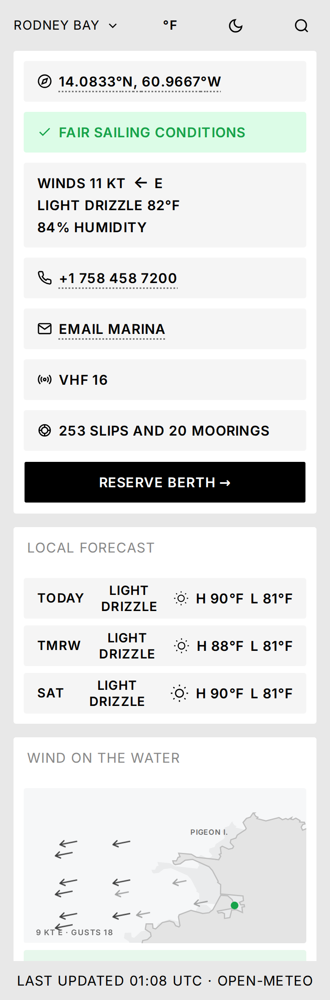
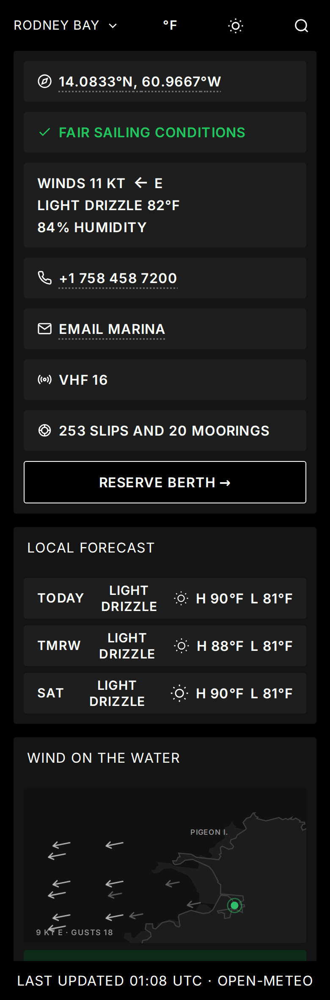
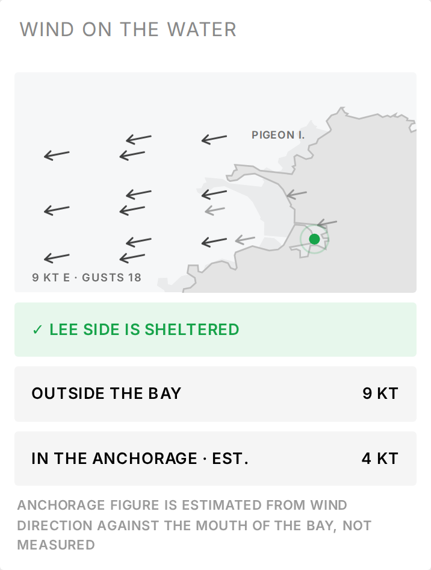

# BayStats

I built a live conditions board for sailors in St. Lucia. One screen answers what a cruiser actually asks before moving the boat: what is the weather doing, when is the tide, where is the shelter, and can I get a berth tonight.

**Live at [baystats.com](https://baystats.com)**. No account, nothing behind a paywall, built to be read on a phone in a cockpit.

| | | |
|---|---|---|
|  |  |  |
| Rodney Bay, light | The same, dark | The wind field card |

---

## The problem

A cruiser arriving in the Eastern Caribbean assembles their picture of a bay from four or five sources: a weather app that knows nothing about marinas, a tide table, a cruising guide two seasons out of date, and a WhatsApp group. The operational details are the hardest to find and the most urgent when they are needed. Finding a marina's VHF channel at dusk in a rising wind should not take three websites.

BayStats puts the whole picture on one screen per marina, and keeps the practical facts, phone number, VHF channel, slips, moorings, fuel, water and power, alongside the conditions rather than several sites away.

## What it does

- **Conditions at a glance.** Wind, sky and humidity, with a direct verdict on whether it is fair sailing.
- **Wind on the Water.** A map of the bay showing where the shelter is, with the wind outside the bay and inside the anchorage side by side.
- **Local forecast.** Three days, without hourly detail that goes unread.
- **Current and tide.** Speed, direction, height, and the next high and low.
- **Storm watch.** Active systems and the seven-day tropical outlook for two basins.
- **Sun and moon.** Sunrise, sunset and moon phase, framed around whether there will be light to anchor by.
- **Marina services.** Fuel, water, power and chandlery ranked ahead of the amenities a boat can do without.
- **Contact.** Phone, email and VHF channel, one tap each.

Two marinas are live. The other twenty-two appear as coming soon and collect an email for launch. Two bays with real data are worth more than twenty-four with guesses.

## How I built it

I built this alone, with AI as the medium the work was done in rather than as autocomplete. I wrote and reviewed the specification with AI, decomposed it into build packets, and ran AI agents in parallel against those packets. The specification, the execution plan, and the record of what each packet produced are all in `docs/`.

The commit history records the pace: 282 commits between 13 and 26 February 2026 across nine working days, 115 of them in a single day. The wind field card and a subsequent refactor were added in one day in September.

The result is roughly 13,000 lines of TypeScript, 22 backend endpoints, 37 database migrations, and a Playwright suite that runs against a stubbed backend in under three seconds.

Working at that speed puts the value somewhere other than implementation. It sits in framing the problem precisely, deciding what to cut, and catching the places where a confident answer is wrong. The wind card is the clearest example.

## Where judgment mattered: the wind card

`design_handoff_wind_field_card/` holds a complete design brief for a card that turns a single wind reading into a map of where the shelter is. Building it surfaced three problems that no amount of implementation skill would have resolved.

**The brief contradicted itself.** It gave a formula for the direction the arrows point, then worked an example that only holds with the opposite sign. Implemented as written, every arrow would have pointed into the wind rather than with it. On a page a sailor uses to choose an anchorage, an arrow pointing the wrong way is worse than no arrow at all, and the brief said so itself. I took the worked example over the stated rule and verified it against the rendered output before shipping.

**The data could not support the claim the card was making.** The card exists to show that the anchorage is calmer than the open sea. The specified weather service samples eight points across roughly two kilometres, and every model it offers returns an identical value at all eight, because their grids are two to twenty-five kilometres wide. The sheltering effect is finer than that service can resolve. No amount of engineering changes that.

**So I labelled the estimate rather than fabricating a measurement.** Printing the same figure in both rows would have made the card pointless; inventing a difference would have been dishonest. The anchorage figure now comes from a stated model, the wind direction against the mouth of the bay, and the card says so directly beneath it: *anchorage figure is estimated from wind direction against the mouth of the bay, not measured*. The model can only reduce a wind speed, never raise one. When the feed fails and nothing is cached, the map is removed rather than drawn from stale or interpolated data.

That is the standard I hold anything modelled to: an estimate is legitimate, provided the reader can tell it apart from a measurement. The rest of the product follows the same rule.

## What the product does not know

- The anchorage wind is modelled, not measured. Resolving it properly requires a sensor in the water.
- Two marinas carry real data. The remainder are placeholders.
- Tide and current are calculated from per-location parameters rather than a tide gauge.
- The forecast is a general public model with no marine correction for these islands.
- The order of the cards reflects my judgment. It has not yet been tested against users.

## Decisions, including the ones I reversed

- **I removed the paywall entirely.** It was already built: checkout, payment webhooks, tiers, a locked-region banner. Two marinas of real data does not earn the right to charge, and a demo that asks for a card collects no feedback. I removed every trace rather than disabling it.
- **I narrowed the live locations from twenty-four to two.** The rest became a coming-soon screen that captures an email, which serves both honesty and a signal about which bay to build next.
- **I removed the sign-in entry point.** Nothing on the page requires an account, so leaving a login link would only suggest a barrier that no longer exists.
- **I withdrew the customs and clearance card from public view.** Those hours change without notice, and publishing them wrong is worse than not publishing them.
- **I rejected inventing shelter data.** The easier version of the wind card interpolates a believable anchorage figure and looks better for it. It would also mislead someone choosing where to spend the night.

## What I would do next

1. **Install a sensor in Rodney Bay.** It converts the wind card's estimate into a measurement, which is the difference between a well-made graphic and a reason to open the app every morning.
2. **Act on the coming-soon signups.** They are the only genuine demand signal the product has. The next bay should be whichever one people keep asking for.
3. **Sell to marinas rather than sailors.** Berth availability and services data is worth more to a marina that wants to be found than to a cruiser who wants to look. A listing product has a buyer; a weather app has users.

## How it is built

The front end is a single-page React application served as static files by nginx. It calls a small Express API kept running by PM2 on the same server, backed by Supabase. Upstream weather calls are cached server-side, so opening the page never triggers a fresh request to an external service.

The wind map is inline SVG generated from the data, drawn over real coastline geometry for Rodney Bay and Marigot Bay that I extracted from OpenStreetMap, projected, simplified and committed as fixed paths. No map tiles, no charting library, no animation library, and no dependency added for any of it.

React 19 / TypeScript / Vite / Express / Supabase / Playwright / nginx / PM2

## Where to look

| Path | Contents |
|---|---|
| `docs/PRD.md` | The product specification |
| `docs/packets/` | The build packets the specification was decomposed into |
| `docs/BUILD_RECORD.md` | What each packet produced |
| `design_handoff_wind_field_card/` | The design brief and reference designs for the wind card |
| `src/components/windfield/` | The wind card and its committed coastline geometry |
| `netlify/functions/` | Backend handlers, including the cached wind field endpoint |
| `tests/` | Playwright suite; the backend is stubbed, so it runs without keys |
| `supabase/migrations/` | The database schema, in order |

## Running it

Not installable as published, since the keys are redacted. With your own Supabase project and a `.env` completed from `.env.example`:

```
npm install
npm run dev     # Vite on 5173, API on 3457
npm test        # Playwright, no keys needed, backend stubbed
```

---

Weather and marine data from [Open-Meteo](https://open-meteo.com). Coastline geometry (c) [OpenStreetMap](https://www.openstreetmap.org/copyright) contributors, ODbL.
