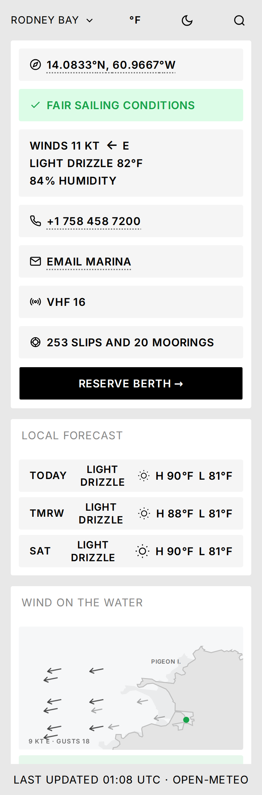
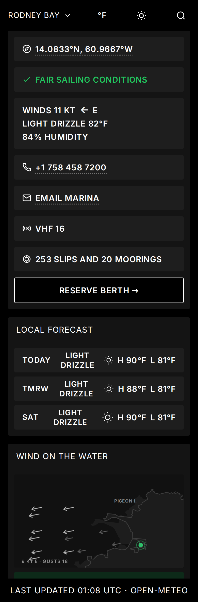
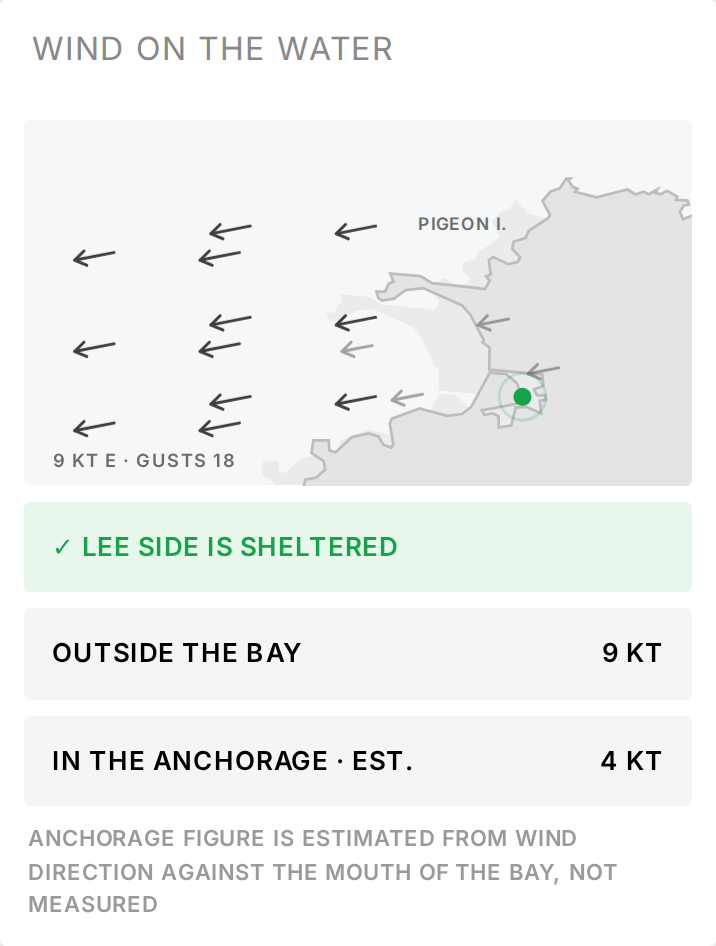
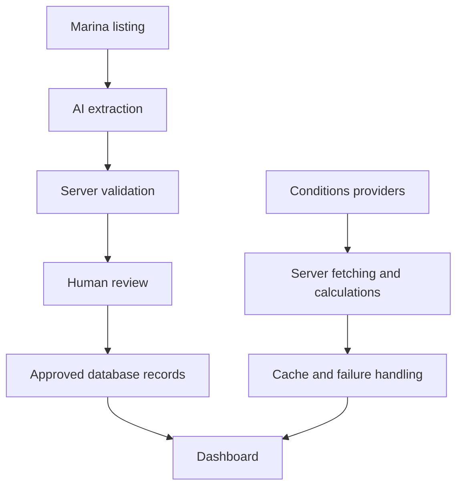

# BayStats

*My client work stays confidential, so I build personal projects like this to share how I think and work. I built BayStats while living aboard an [Oceanis 473](https://www.beneteau.com/oceanis-1995-2008/oceanis-clipper-473). I wanted a free, simple dashboard with the information I needed to plan a day’s sailing.*

**[Try the live app](https://baystats.com)**

## Contents

- [What is this?](#what-is-this)
- [Design principles & business value](#design-principles--business-value)
- [Key engineering decisions](#key-engineering-decisions)
- [Architecture](#architecture)
- [Validation & limitations](#validation--limitations)
- [Technical reference](#technical-reference)
- [Run it yourself](#run-it-yourself)
- [License & credits](#license--credits)

## What is this?

A mobile-friendly dashboard that puts Caribbean weather, wind, storm information, and marina details in one place. AI organizes scattered marina listings for human approval; conditions come directly from data providers.

The current build covers two live locations, Rodney Bay and Marigot Bay. The repository includes five approved marina records.

| | | |
|---|---|---|
|  |  |  |
| Rodney Bay, light | The same dashboard, dark | Wind conditions and estimated shelter |

This is the source behind the live product, published as an installable case study under the MIT license.

## Design principles & business value

- **Automate the legwork. Keep human oversight.** AI turns inconsistent listings into structured records. A person approves what gets published.
- **Make trust visible.** Keep AI content separate from conditions data, label estimates, and show when information is unavailable.
- **Build for interruptions.** Cached feeds and fallback behavior help the dashboard stay useful when providers fail.
- **Control cost and access.** AI runs only when an admin requests it. Database permissions limit who can read and change data.

The same approach applies to supplier, property, and provider directories, and dashboards for field operations.

## Key engineering decisions

### Use AI where the source material is inconsistent

Marina listings arrive as free text, with different layouts and levels of detail. Gemini extracts them into a fixed 22-field schema. Server validation checks the values, and an admin reviews each record before publication.

AI runs only when an admin submits a listing, so extraction cost is tied to maintenance work rather than visitor traffic. The scraper accepts one approved HTTPS hostname and rejects redirects.

[Extraction implementation](netlify/functions/marina-scrape.ts)

### Protect published information during updates

Re-extracting a marina saves the new information separately for comparison. It does not overwrite the published record or an admin’s edits.

This allows automation to assist maintenance while preserving editorial control.

[Extraction and update handling](netlify/functions/marina-scrape.ts)

### Keep conditions independent of AI

Weather, wind, sea state, storm information, and daily sun and moon times are fetched or computed by server code. The model does not generate those numbers.

Wind samples are fetched in one request per location and cached for ten minutes. If that request fails, the dashboard can use its last good wind value. Without a cached value, it hides the wind map. Storm Watch explicitly reports when its feed is unavailable.

[Wind feed and cache](netlify/functions/wind-field.ts) · [Storm feed](netlify/functions/tropical.ts)

### Show the limits of the data

The weather feed is too coarse to measure shelter within an anchorage. BayStats therefore labels its shelter-adjusted wind figure as an estimate.

Earlier tide and current cards were removed because they presented modeled estimates as readings. The wind display also went through a correction when its initial arrows pointed in the wrong direction.

These changes reflect a product principle: the interface should make the evidence and its limits clear.

[Wind card](src/components/windfield/WindFieldCard.tsx) · [Design handoff](design_handoff_wind_field_card/README.md)

## Architecture

Two pipelines reflect two different levels of trust. Extracted facility information requires human approval. Conditions are fetched and computed directly.


```mermaid
flowchart TD
    A["Marina listing"] --> B["AI extraction"]
    B --> C["Server validation"]
    C --> D["Human review"]
    D --> E["Approved database records"]
    E --> F["Dashboard"]
    G["Conditions providers"] --> H["Server fetching and calculations"]
    H --> I["Cache and failure handling"]
    I --> F
```

**Facility data:** MarineLink listings → Gemini extraction → validation → admin approval → Supabase.

**Conditions:** Open-Meteo, the National Hurricane Center, and sunrise-sunset.org → server code → dashboard. Modeled figures are labeled separately.

### Access and security

- Row-level security is enabled on all 11 database tables.
- Admin-management database functions are restricted to the server.
- Public endpoints return a fixed set of public columns; public queries expose approved records.
- Sign-in uses emailed one-time links. Sign-in and session tokens are stored as SHA-256 hashes.
- Database functions have a fixed search path and perform specific operations. An earlier general-purpose SQL function was removed.

[Database schema](supabase/schema.sql) · [Authentication](src/lib/auth.ts) · [Public data handling](netlify/functions/admin-marinas.ts) · [Security migration](supabase/migrations_history/031_security_lockdown.sql)

## Validation & limitations

### What is tested

The repository includes:

- **20 unit tests** covering extraction validation, shelter calculations, storm parsing, wind readings, and token hashing.
- **17 browser tests** against a stubbed backend.

Both suites run offline. They verify application behavior without depending on live provider availability.

[Unit tests](unit/) · [Browser tests](tests/)

### What the wind estimate means

Open-Meteo’s grids are approximately 2–25 km wide. The eight sample points used for a bay span approximately 2–5 km and return the same value, so they do not resolve local shelter.

The anchorage estimate applies a factor based on wind direction and the bay’s mouth bearing. That factor is bounded between 0.40 and 1.00, reducing the reported wind speed by up to 60%.

The interface labels this as an estimate, not a measurement. A cached wind value may remain available during a feed failure; without one, the map is hidden.

### Scope and build evidence

The location registry contains 16 locations; two are currently live. The offline tests do not establish the accuracy or availability of external feeds.

The planning documents preserve the original decisions and intended scope. Where the shipped product differs, the PRD includes a “What changed since this plan” note.

[Product specification and risks](docs/PRD.md) · [Pre-execution build plan](docs/BUILD_RECORD.md) · [Wind-card acceptance criteria](design_handoff_wind_field_card/README.md)

## Technical reference

<details>
<summary>Stack and deployment</summary>

| Layer | Implementation |
|---|---|
| Frontend | React 19, TypeScript, Vite 7, React Router 7 |
| UI | Inline dashboard theme, Tailwind for admin screens, SVG wind map |
| Backend | Express 5 on Node |
| Database | Supabase / PostgreSQL |
| AI extraction | Google Gemini |
| Authentication | Emailed links; hashed tokens; httpOnly session cookie |
| Email | Resend |
| Weather and sea state | Open-Meteo |
| Storm information | National Hurricane Center |
| Sun and moon times | sunrise-sunset.org and Open-Meteo |
| Map geometry | OpenStreetMap coastline, committed as SVG paths |
| Tests | Node test runner and Playwright |
| Hosting | nginx, PM2, Let’s Encrypt |

Request handlers remain in `netlify/functions/` for historical reasons. They are served by Express.

</details>

<details>
<summary>Where to find the implementation</summary>

| Location | Purpose |
|---|---|
| [server/index.ts](server/index.ts) | Express entry point |
| [netlify/functions/](netlify/functions/) | Extraction, conditions, authentication, and admin handlers |
| [src/pages/](src/pages/) | Dashboard, account, and admin screens |
| [src/components/windfield/](src/components/windfield/) | Wind visualization |
| [src/config/](src/config/) | Locations, basemaps, and sample coordinates |
| [src/hooks/](src/hooks/) | Feed fetching |
| [src/lib/](src/lib/) | Authentication, database client, and access rules |
| [supabase/schema.sql](supabase/schema.sql) | Schema exported from the live database |
| [supabase/seed.sql](supabase/seed.sql) | Five approved marina records |
| [supabase/migrations_history/](supabase/migrations_history/) | Database change history |
| [deploy/](deploy/) | nginx, certificate bootstrap, and PM2 configuration |
| [docs/](docs/) | Specifications and build records |

</details>

## Run it yourself

You need Node 20 or later, a Supabase project, a Gemini API key, and a Resend account with a verified sending domain.

### 1. Install and test

```bash
git clone https://github.com/kgsubs/baystats_public.git
cd baystats_public
npm ci
npm run test:unit
npx playwright install chromium
npm test
```

Chromium installation is required only once. Both test suites run offline.

### 2. Configure your accounts

```bash
cp .env.example .env
```

Fill in the following settings:

| Variable | Value |
|---|---|
| `VITE_SUPABASE_URL` | Supabase project URL |
| `SUPABASE_SERVICE_KEY` | Supabase secret key |
| `SUPABASE_DB_URL` | Supabase session-pooler connection string, including your database password |
| `GEMINI_API_KEY` | Google AI Studio API key |
| `RESEND_API_KEY` | Resend API key |
| `EMAIL_FROM` | Sender address on your verified domain |
| `SITE_URL` | `http://localhost:5173` |
| `ADMIN_EMAIL` | Email address you will use to sign in |

### 3. Create the database

Run these commands with your connection string in place of `<SUPABASE_DB_URL>`:

```bash
psql "<SUPABASE_DB_URL>" -v ON_ERROR_STOP=1 -f supabase/schema.sql
psql "<SUPABASE_DB_URL>" -v ON_ERROR_STOP=1 -f supabase/seed.sql
```

Alternatively, paste both files into the Supabase SQL editor, schema first.

### 4. Start the app and enable admin access

```bash
npm run dev
```

Open http://localhost:5173.

In another terminal:

```bash
npx tsx scripts/create-admin.ts
```

Sign in at http://localhost:5173/admin/login using `ADMIN_EMAIL`. You can then extract a marina from its MarineLink listing and review it for publication.

**Server deployment:** see [deploy/](deploy/) for nginx configuration, certificate setup, and PM2 configuration.

## License & credits

MIT. See [LICENSE](LICENSE).

Weather and marine data: [Open-Meteo](https://open-meteo.com). Storm data: [National Hurricane Center](https://www.nhc.noaa.gov). Coastline geometry: © [OpenStreetMap](https://www.openstreetmap.org/copyright) contributors, ODbL.
